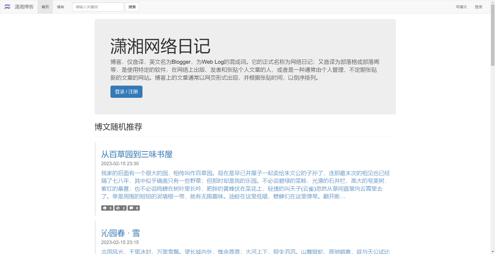
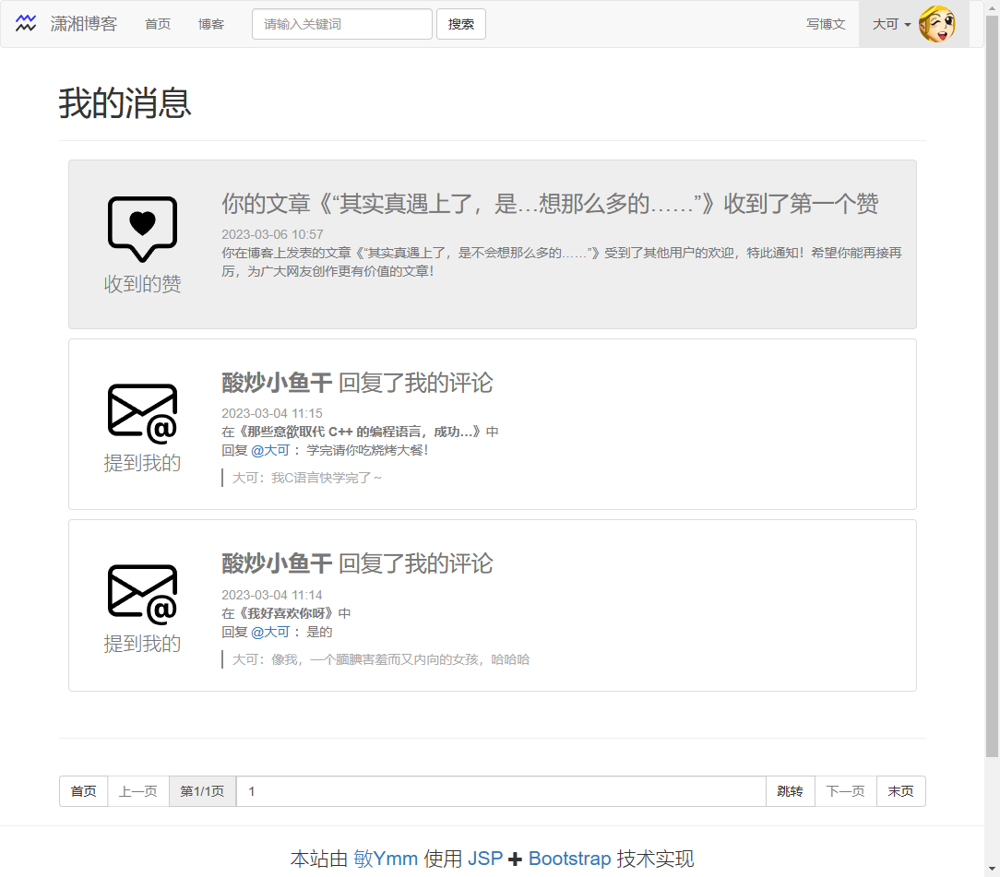

# 潇湘博客 XiaoXiangBlog

## 说明
一个Eclipse项目 - Version: 2020-06 (4.16.0)。

## 潇湘博客

一个简单的Java Web项目，使用 JSP、Servlet、MySQL、Bootstarp等技术实现。完成了发布博客、阅读博客、点赞、发布评论、个人资料更改、自适应电脑手机等功能。如果您喜欢，请点击星星，谢谢。

## XiaoXiangBlog

A simple java web project, use JSP, Servlet, MySql, Bootstarp and others. Realized the function of publish blog, read blog, show like, publish comment, person profile change,adaptive desktop mobile and others.If you like this, please click the star, thanks.

## 图片（Show）
首页截图：

文章和评论截图：

---

个人资料截图：

---

---

个人消息截图：

## 项目其他说明（Other）

### 数据库（DataBase）

***所有账号的密码都为 （The password of all accounts is ）`123456`！***

数据库配置文件（SQL config file）：src/druid.properties

数据库结构文件（SQL structure file）：src/xiaoxiang_blog.sql

数据库测试数据文件（SQL data file）：src/xiaoxiang_blog_data.sql

测试数据文件里面内置了一些文章、评论、测试账号等（文章版权归原作者，摘抄时并未进行任何沟通）用于测试。
Some articles, comments, test accounts, etc. are built in the test data file (the copyright of the article belongs to the original author, and no communication is made during the extraction) for testing.

### 管理员（Admin）

管理员注册配置文件（admin config file）：src/admin.properties

管理员采用注册的形式，在配置文件文件中写好管理员的账号，然后去注册页面注册，注册后就是管理员。或者也可以直接修改数据库，把role字段改为1。
The administrator uses the form of registration, writes the administrator's account in the configuration file, and then goes to the registration page to register. After registration, the administrator is the administrator. Or you can directly modify the database and change the role field to 1.

### 日志（Log）

日志配置文件（log config file）：src/logback.xml

Debug模式配置文件（debug mode config file）：src/minuhy/xiaoxiang/blog/config/DebugConfig.java

日志处理详情请看配置文件。
See the configuration file for log processing details.

### 文件夹（Folder）

- 可删除的HTML测试文件夹（Removable HTML test folder）：WebContent/html

  里面是编写前端时的代码，删除完全不影响正常使用。
  It contains the code when writing the front end. Deleting it does not affect normal use at all.

- 预制图片文件夹（Prefabricated picture folder）：WebContent/img

  内置一些系统需要用到的图标等。
  Built-in some icons needed by the system.

- 预制头像文件夹（Prefabricated avatar folder）：WebContent/img/avatar

  h001.png到h138.png都是从QQ安卓版安装包中提取出来的头像图片文件，版权解释归QQ所有，本项目仅用于测试。
  Both h001.png and h138.png are avatar image files extracted from the QQ Android installation package. The copyright interpretation belongs to QQ. This project is only used for testing.

- HTML库文件夹（HTML Library Folder）：WebContent/lib

  所有库采用下载的形式加入到项目中，库中的代码版权归原作者所有。
  All libraries are added to the project in the form of download, and the code copyright in the library belongs to the original author.

- HTML css js 文件夹（Folder）：WebContent/lib/xiaoxiang

  自己写的js和css存放在此。
  My js and css file in this.

- JSP公共组件（common page）：WebContent/partial

  包括页头、页脚、导航栏等。
  Include page head，page foot and nav.

- JSP管理员组件（admin page）：WebContent/admin

  管理员页面的所有JSP文件。
  All admin page in this.

### 使用到的库（Lib）

- commons-fileupload-1.5 https://commons.apache.org/proper/commons-fileupload/

- commons-io-2.11.0 https://commons.apache.org/proper/commons-io/

- druid-1.2.16 https://github.com/alibaba/druid

- fastjson-1.2.83 https://github.com/alibaba/fastjson

- mysql-connector-java-5.1.49 https://dev.mysql.com/blog-archive/mysql-connector-j-5-1-49-ga-has-been-released/

- logback-classic-1.2.11 https://logback.qos.ch/download.html

- logback-core-1.2.11 https://logback.qos.ch/download.html

- slf4j-api-1.7.36 https://www.slf4j.org/download.html

- bootstrap-3.4.1 https://getbootstrap.com/docs/3.4/

- doT-1.1.3 https://github.com/olado/doT

- html5shiv-3.7.3 https://github.com/aFarkas/html5shiv

- jquery-1.12.4 https://jquery.com/

- respond.js-1.4.2 https://github.com/scottjehl/Respond

- summernote-v0.8.20 https://summernote.org/

### 日志（Log）

初次完成：2023-03-08

实现：博客、评论、点赞、个人资料、基础管理