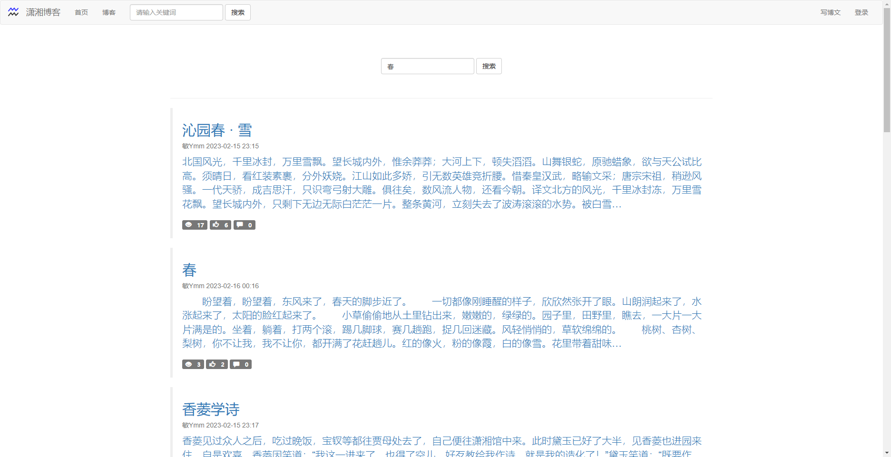
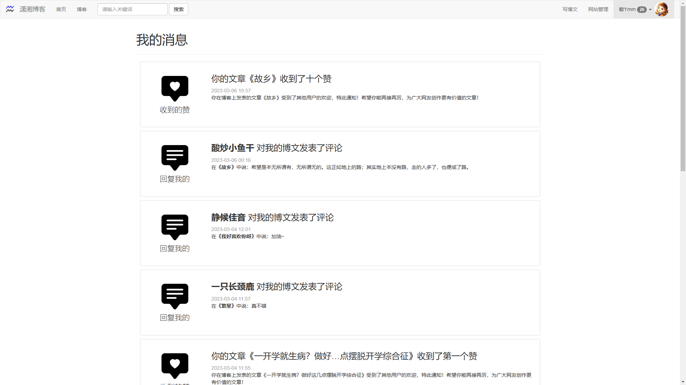

# 潇湘博客平台 XiaoXiangBlog

## 说明

- Eclipse 项目 - Version: 2020-06 (4.16.0)。
- JDK8。

## 潇湘博客（XiaoXiangBlog）

一个简单的Java Web项目，使用 JSP、Servlet、MySQL、Bootstarp等技术实现。完成了注册登录，发布博客、阅读博客、点赞、发布评论、个人资料更改、自适应电脑手机等功能。如果您喜欢，请点击星星，谢谢。

A simple Java Web project, use JSP, Servlet, MySql, Bootstarp and others. Realized the function of login and register, publish blog, read blog, show like, publish comment, person profile change,adaptive desktop mobile and others.If you like this, please click the star, thanks.

## 功能展示（Show）

### 首页

首页有一个简单的介绍面板，然后下面是博文推荐，随机推荐10篇博文。

### 登录注册页面

登录，需要输入验证码，验证码为一个简单的算式，可以记住账号密码。登录后跳转回登录前的位置，并且部分编辑数据能被保存（不由登录组件实现）。

注册。

### 文章页面

上面显示标题和时间（包括文章是否修改，修改时间），右边有操作按钮，可以对文章进行编辑或者删除操作。中间有作者信息、文章数据统计和表态按钮，可以点赞、取消点赞、反对、取消反对（反对不会被统计，但是会被记录）等操作。下面是评论区，可以发表评论，查看评论，评论使用Ajax动态加载，每次加载10条评论。

文章评论采用动态分页加载策略，每次加载10条。删除弹窗与回复弹窗类似，回复删除都是采用Ajax技术，不需要刷新整个页面（除了在上面发表评论）。评论的管理由评论者本人、网站管理员和文章作者共同管理。

### 博客页面

博客页面显示本站所有用户的博客，可以按照点赞量、评论量、浏览量、发表时间和修改时间等进行排序，使用分页技术，每页10条数据（如下页脚）。

### 搜索页面

支持关键词搜索，能搜索标题、内容和用户，分页技术与博客页面一致。

### 写博文页面

使用summernote-v0.8.20实现富文本编辑，实现了图片上传，因为是存数据库中的，所以最长6w的代码文本长度（后面可改进以文件形式存放或者其他方案），发表博文使用Ajax技术。

### 个人页面

个人资料页面，有个人的数据统计，个人资料和个人博文列表（分页）。

编辑资料页面，可以编辑头像（预制）、昵称、签名、性别、家乡和联系方式等个人资料。

简单的修改密码界面。

### 消息页面

未读消息是黑色、填充的，消息显示后变成灰色、去填充的。

消息附带链接，点击消息到达指定文章的指定位置。

### 简单而又出戏的管理界面（没时间做了，随便写了点，没用Bootstrap）

管理主页，显示一些本站的统计数据。

用户管理界面。

博客管理界面。

评论管理界面。

公告发布界面，可筛选发送对象，设置点击后跳转位置，发送后以消息的形式通知到指定用户。

编辑数据界面，编辑框框是动态生成的，不是写好的，修改后能跳回原来进入修改的位置。

### 手机端浏览界面一览

手机界面与电脑共用一个页面，采用响应式前端框架Bootstrap实现。

手机端界面与电脑端区别不大，有的地方为了适应手机的操作，重新做了排版，比如阅读页面中部部分。

手机端的发布博文界面不太好操作，但是依然能使用。

在手机端看来貌似电脑的布局大了许多。

管理界面没用任何的框架，依然是如此地出戏 QwQ ~。

总体上看功能相对简单，但是个人感觉界面是挺精致的（除了管理界面）。

## 项目说明（Other）

### 数据库（DataBase）

***所有账号的密码都为 （The password of all accounts is ）`123456`！***

数据库配置文件（SQL config file）：src/druid.properties

数据库结构文件（SQL structure file）：src/xiaoxiang_blog.sql

数据库测试数据文件（SQL data file）：src/xiaoxiang_blog_data.sql

测试数据文件里面内置了一些文章、评论、测试账号等（文章版权归原作者，摘抄时并未进行任何沟通）用于测试。
Some articles, comments, test accounts, etc. are built in the test data file (the copyright of the article belongs to the original author, and no communication is made during the extraction) for testing.

### 管理员（Admin）

管理员注册配置文件（admin config file）：src/admin.properties

管理员采用注册的形式，在配置文件文件中写好管理员的账号，然后去注册页面注册，注册后就是管理员。或者也可以直接修改数据库，把role字段改为1。
The administrator uses the form of registration, writes the administrator's account in the configuration file, and then goes to the registration page to register. After registration, the administrator is the administrator. Or you can directly modify the database and change the role field to 1.

### 日志组件（Logback）

日志配置文件（log config file）：src/logback.xml

Debug模式配置文件（debug mode config file）：src/minuhy/xiaoxiang/blog/config/DebugConfig.java

日志处理详情请看配置文件。
See the configuration file for log processing details.

### 文件夹说明（Folder）

- 可删除的HTML测试文件夹（Removable HTML test folder）：WebContent/html

  里面是编写前端时的代码，删除完全不影响正常使用。
  It contains the code when writing the front end. Deleting it does not affect normal use at all.

- 预制图片文件夹（Prefabricated picture folder）：WebContent/img

  内置一些系统需要用到的图标等。
  Built-in some icons needed by the system.

- 预制头像文件夹（Prefabricated avatar folder）：WebContent/img/avatar

  h001.png到h138.png都是从QQ安卓版安装包中提取出来的头像图片文件，版权解释归QQ所有，本项目仅用于测试。
  Both h001.png and h138.png are avatar image files extracted from the QQ Android installation package. The copyright interpretation belongs to QQ. This project is only used for testing.

- HTML库文件夹（HTML Library Folder）：WebContent/lib

  所有库采用下载的形式加入到项目中，库中的代码版权归原作者所有。
  All libraries are added to the project in the form of download, and the code copyright in the library belongs to the original author.

- HTML css js 文件夹（Folder）：WebContent/lib/xiaoxiang

  自己写的js和css存放在此。
  My js and css file in this.

- JSP公共组件（common page）：WebContent/partial

  包括页头、页脚、导航栏等。
  Include page head，page foot and nav.

- JSP管理员组件（admin page）：WebContent/admin

  管理员页面的所有JSP文件。
  All admin page in this.

### 使用到的库（Lib）

- commons-fileupload-1.5 https://commons.apache.org/proper/commons-fileupload/

- commons-io-2.11.0 https://commons.apache.org/proper/commons-io/

- druid-1.2.16 https://github.com/alibaba/druid

- fastjson-1.2.83 https://github.com/alibaba/fastjson

- mysql-connector-java-5.1.49 https://dev.mysql.com/blog-archive/mysql-connector-j-5-1-49-ga-has-been-released/

- logback-classic-1.2.11 https://logback.qos.ch/download.html

- logback-core-1.2.11 https://logback.qos.ch/download.html

- slf4j-api-1.7.36 https://www.slf4j.org/download.html

- bootstrap-3.4.1 https://getbootstrap.com/docs/3.4/

- doT-1.1.3 https://github.com/olado/doT

- html5shiv-3.7.3 https://github.com/aFarkas/html5shiv

- jquery-1.12.4 https://jquery.com/

- respond.js-1.4.2 https://github.com/scottjehl/Respond

- summernote-v0.8.20 https://summernote.org/

## 开源地址

1. GitHub：[https://github.com/Minuhy/XiaoXiangBlog](https://github.com/Minuhy/XiaoXiangBlog)
